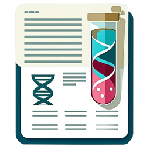

 

# BioForms

    

BioForms is a web-based application that allows the creation of customizable metadata forms based on predefined templates to collect metadata in a standardized and machine readable way. The forms ensure data accuracy and consistency by using controlled vocabularies, such as ontologies. BioForms integrates with the CEDAR ecosystem and enables data export and access via Office 365 (Excel, SharePoint).

 

##  Quick Usage Overview

### For BioForm Administrators

##### Setting up a form:
- Define the required fields for your form.
- Create the template within the CEDAR ecosystem.
- Set up a SharePoint folder to store the template and grant access to the relevant users.
### For BioForm Users & Collaborators
- Your administrator will provide you with a link to your web BioForm.

  Example: www.bioforms.carrerasresearch.org/genomica
      
- Simply share this link with your collaborators so they can input the required metadata.
- Once a collaborator submits the form, you’ll receive an email confirmation from SharePoint. This notification confirms whether a new file (Excel) has been uploaded or an existing file has been updated.
##### Accessing & Downloading Information
- Download the latest submission directly from the link in your confirmation email.
- To access all past submissions, navigate to the designated SharePoint folder via Office. There, you can review the full submission history and download previous files as needed.

 
   

### References
- **BioForms Repository:** [BioForms GitHub Repository](https://github.com/ijcBIT/BioForms)
- **CEDAR Project:** [CEDAR Template Editor GitHub Repository](https://github.com/metadatacenter)
